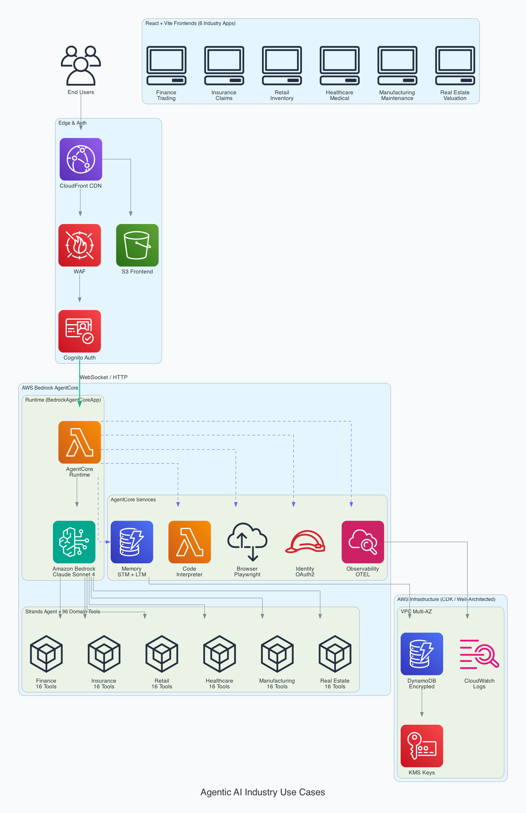

# Agentic AI Industry Use Cases

Production-grade agentic AI applications across 6 industries, built with **AWS Strands Agents SDK** and **Bedrock AgentCore SDK**. Each application includes a Strands-powered backend agent, React frontend, and AWS CDK infrastructure.

## Architecture



**Tech Stack:**
- **Agent Framework:** [Strands Agents SDK](https://github.com/strands-agents/sdk-python) v1.28.0
- **Deployment Platform:** [Bedrock AgentCore SDK](https://github.com/aws/bedrock-agentcore-sdk-python) v1.4.1
- **Frontend:** React 19, Vite 6, TypeScript 5, TailwindCSS 3, Recharts
- **Infrastructure:** AWS CDK (Python), Well-Architected
- **Model:** Amazon Bedrock (Claude Sonnet 4, configurable)

## Industry Applications

| # | Industry | Agent | Tools | Frontend | Color |
|---|----------|-------|-------|----------|-------|
| 1 | [Finance Trading](#1-finance-trading) | TradingAssistant | 16 | Trading dashboard, risk charts | Blue |
| 2 | [Insurance Claims](#2-insurance-claims) | ClaimsProcessor | 16 | Claims pipeline, fraud alerts | Indigo |
| 3 | [Retail Inventory](#3-retail-inventory) | InventoryManager | 16 | Stock dashboard, demand forecast | Emerald |
| 4 | [Healthcare Medical](#4-healthcare-medical) | MedicalRecordsAnalyzer | 16 | Patient records, clinical support | Rose |
| 5 | [Manufacturing](#5-manufacturing-maintenance) | MaintenancePredictor | 16 | Equipment health, predictions | Amber |
| 6 | [Real Estate](#6-real-estate-valuation) | PropertyValuator | 16 | Valuations, market analysis | Cyan |

### 1. Finance Trading

**Agent:** `apps/finance-trading/agent/`

AI-powered trading assistant for financial markets with real-time analysis.

| Tool Category | Tools |
|--------------|-------|
| Market Data | `get_stock_quote`, `get_market_overview`, `get_historical_prices`, `get_sector_performance` |
| Risk Analysis | `calculate_var`, `stress_test_portfolio`, `analyze_portfolio_risk`, `monte_carlo_simulation` |
| Portfolio | `get_portfolio_positions`, `calculate_pnl`, `get_portfolio_allocation`, `suggest_rebalancing` |
| Trade Execution | `place_order`, `cancel_order`, `get_order_status`, `get_trade_history` |

**Frontend:** Portfolio value chart, positions table, sector allocation, VaR cards, stress test scenarios, Monte Carlo projections, VIX gauge, treasury yields.

**Compliance:** SOX, MiFID II, Dodd-Frank.

### 2. Insurance Claims

**Agent:** `apps/insurance-claims/agent/`

Claims processing with AI-powered fraud detection and automated settlement.

| Tool Category | Tools |
|--------------|-------|
| Claims | `submit_claim`, `get_claim_status`, `assess_damage`, `list_claims` |
| Fraud Detection | `analyze_fraud_risk`, `check_fraud_patterns`, `generate_fraud_report`, `get_fraud_dashboard` |
| Policy | `verify_policy`, `check_coverage`, `get_policy_history`, `search_policies` |
| Settlement | `calculate_settlement`, `approve_settlement`, `get_settlement_analytics`, `estimate_reserve` |

**Frontend:** Claims pipeline funnel, fraud risk distribution, flagged claims list, settlement trends, reserve adequacy gauge.

**Compliance:** HIPAA (medical claims), state insurance regulations, fair claims practices.

### 3. Retail Inventory

**Agent:** `apps/retail-inventory/agent/`

Omnichannel inventory optimization with ML-based demand forecasting.

| Tool Category | Tools |
|--------------|-------|
| Inventory | `check_inventory`, `get_inventory_summary`, `transfer_stock`, `get_stockout_report` |
| Demand Forecast | `forecast_demand`, `get_demand_trends`, `auto_reorder`, `get_abc_analysis` |
| Supplier | `get_supplier_performance`, `list_suppliers`, `create_purchase_order`, `get_supplier_risk_report` |
| Pricing | `get_pricing_analysis`, `optimize_pricing`, `get_competitive_intelligence`, `get_margin_report` |

**Frontend:** ABC classification donut, stock health by category, demand forecast with confidence bands, supplier scorecards, competitive pricing.

**Compliance:** PCI-DSS, GDPR. Handles 10x Black Friday peak scaling.

### 4. Healthcare Medical

**Agent:** `apps/healthcare-medical/agent/`

Medical records analysis with clinical decision support and HIPAA compliance.

| Tool Category | Tools |
|--------------|-------|
| Records | `get_patient_summary`, `search_medical_records`, `get_medication_list`, `get_lab_results` |
| Clinical | `check_drug_interactions`, `assess_symptoms`, `get_clinical_guidelines`, `calculate_risk_score` |
| Scheduling | `schedule_appointment`, `get_provider_availability`, `get_upcoming_appointments`, `send_appointment_reminder` |
| Analytics | `get_patient_analytics`, `get_population_health_metrics`, `get_readmission_risk`, `get_care_gap_analysis` |

**Frontend:** Patient records table, drug interaction checker, risk score gauges (ASCVD, HbA1c, Morse), vitals trend charts, preventive care compliance, readmission risk.

**Compliance:** HIPAA (MFA required, customer-managed KMS, PHI encryption, 6-year log retention). HL7 FHIR compatible.

### 5. Manufacturing Maintenance

**Agent:** `apps/manufacturing-maintenance/agent/`

Predictive maintenance with IoT sensor analysis and failure prediction.

| Tool Category | Tools |
|--------------|-------|
| Equipment | `get_equipment_status`, `get_equipment_list`, `get_sensor_data`, `get_equipment_alerts` |
| Prediction | `predict_failure`, `analyze_vibration`, `detect_anomalies`, `get_reliability_metrics` |
| Maintenance | `schedule_maintenance`, `generate_work_order`, `get_maintenance_history`, `get_maintenance_calendar` |
| Parts | `check_spare_parts`, `order_spare_parts`, `get_parts_forecast`, `get_parts_inventory_report` |

**Frontend:** Equipment health bars, RUL gauges, sensor trend charts with anomaly thresholds, reliability metrics (MTBF/MTTR/OEE), weekly maintenance calendar, work order table.

**Standards:** ISO 55000 asset management, ISO 10816 vibration analysis.

### 6. Real Estate Valuation

**Agent:** `apps/real-estate-valuation/agent/`

Property valuation and investment analysis with multiple appraisal methods.

| Tool Category | Tools |
|--------------|-------|
| Valuation | `estimate_property_value`, `get_comparables`, `generate_cma_report`, `calculate_replacement_cost` |
| Market | `get_market_conditions`, `get_neighborhood_analysis`, `get_market_forecast`, `get_market_trends` |
| Investment | `calculate_cap_rate`, `analyze_rental_income`, `calculate_roi`, `get_investment_comparison` |
| Property | `get_property_details`, `check_zoning`, `get_tax_assessment`, `search_properties` |

**Frontend:** Valuation table, property type distribution, market trend charts, neighborhood comparison, cash flow waterfall, ROI projections, investment scoring cards.

**Standards:** USPAP (Uniform Standards of Professional Appraisal Practice).

## Bedrock AgentCore Integration

All 7 AgentCore services are integrated across every application:

| Service | Integration | Purpose |
|---------|------------|---------|
| **Runtime** | `BedrockAgentCoreApp` | HTTP + WebSocket server with health checks, streaming |
| **Memory** | `AgentCoreMemorySessionManager` | STM (conversation) + LTM (preferences, facts, summaries) |
| **Code Interpreter** | `@tool execute_python_code` | Sandboxed Python for calculations, ML, simulations |
| **Browser** | `@tool browse_url` | Cloud Playwright for web research, data scraping |
| **Identity** | `@requires_access_token` | OAuth2 / API key management for external APIs |
| **Observability** | OpenTelemetry | Distributed tracing, tool execution spans, metrics |
| **Gateway** | CDK-ready | Transform REST APIs into MCP tools |

Each agent has 3 memory strategies:
- **Summary** (`summaryMemoryStrategy`) - Session summaries for context continuity
- **Preferences** (`userPreferenceMemoryStrategy`) - User behavior and settings
- **Knowledge** (`semanticMemoryStrategy`) - Domain facts and insights

## Project Structure

```
agentic-ai-industry-use-cases/
├── packages/
│   └── shared/                          # Shared foundation (7 files)
│       ├── base_agent.py                # BaseIndustryAgent (Strands + AgentCore)
│       ├── agentcore_app.py             # BedrockAgentCoreApp factory
│       ├── memory_config.py             # Memory strategy configuration
│       ├── code_interpreter.py          # Code Interpreter @tool
│       ├── browser_tool.py              # Browser @tool
│       ├── observability.py             # OpenTelemetry setup
│       └── security.py                  # Input validation, sanitization
├── apps/
│   ├── finance-trading/
│   │   ├── agent/                       # Strands agent + 16 tools + Dockerfile
│   │   └── frontend/                    # React + Vite + TailwindCSS
│   ├── insurance-claims/
│   │   ├── agent/
│   │   └── frontend/
│   ├── retail-inventory/
│   │   ├── agent/
│   │   └── frontend/
│   ├── healthcare-medical/
│   │   ├── agent/
│   │   └── frontend/
│   ├── manufacturing-maintenance/
│   │   ├── agent/
│   │   └── frontend/
│   └── real-estate-valuation/
│       ├── agent/
│       └── frontend/
├── infra/
│   └── cdk/
│       ├── shared_stack.py              # VPC, WAF, KMS
│       └── stacks/                      # Per-industry CDK stacks
│           ├── finance_stack.py         # Cognito + S3/CloudFront
│           ├── insurance_stack.py       # + DynamoDB (HIPAA)
│           ├── retail_stack.py          # + DynamoDB x2
│           ├── healthcare_stack.py      # + KMS-encrypted DynamoDB
│           ├── manufacturing_stack.py   # + DynamoDB x2
│           └── realestate_stack.py      # + DynamoDB
├── pyproject.toml
├── Makefile
└── .gitignore
```

## Quick Start

### Prerequisites

- Python 3.10+
- Node.js 18+
- AWS account with Bedrock access
- AWS CLI configured (`aws configure`)

### Setup

```bash
# Clone
git clone https://github.com/timwukp/agentic-ai-industry-use-cases.git
cd agentic-ai-industry-use-cases

# Python environment
python3 -m venv .venv && source .venv/bin/activate
pip install strands-agents strands-agents-tools 'bedrock-agentcore[strands-agents]'

# Or use Make
make setup
```

### Run Any Industry App

```bash
# Backend (starts on port 8080)
python apps/finance-trading/agent/app.py

# Frontend (starts on port 3000, proxies to backend)
cd apps/finance-trading/frontend
npm install && npm run dev
```

### Deploy to AWS

```bash
# Install CDK deps
pip install aws-cdk-lib constructs

# Deploy all stacks
cd infra/cdk && cdk deploy --all

# Or deploy one industry
cdk deploy FinanceTrading
```

### Available Make Commands

```bash
make help                    # Show all commands
make run-finance             # Run Finance Trading backend
make dev-finance-frontend    # Run Finance Trading frontend dev server
make run-insurance           # Run Insurance Claims backend
make run-retail              # Run Retail Inventory backend
make run-healthcare          # Run Healthcare Medical backend
make run-manufacturing       # Run Manufacturing Maintenance backend
make run-realestate          # Run Real Estate Valuation backend
make cdk-deploy-all          # Deploy all CDK stacks
make test                    # Run tests
make lint                    # Run linters
```

## AWS Well-Architected

| Pillar | Implementation |
|--------|---------------|
| **Security** | Cognito auth (MFA for HIPAA), WAF rate limiting, KMS encryption, input validation, zero hardcoded secrets |
| **Reliability** | Multi-AZ VPC, DynamoDB (99.999%), CloudFront multi-edge, AgentCore auto-scaling, health checks |
| **Performance** | CloudFront CDN, WebSocket streaming, DynamoDB on-demand, Code Interpreter caching |
| **Cost Optimization** | Serverless (pay-per-use), DynamoDB on-demand, S3 Intelligent Tiering, CloudFront caching |
| **Operational Excellence** | CDK IaC, OpenTelemetry tracing, structured logging, Makefile orchestration |
| **Sustainability** | Serverless compute (no idle), efficient model selection, CDN reducing origin load |

## Security

All code passes security scanning with zero findings:

- **No hardcoded secrets** - All credentials via environment variables or AWS IAM
- **No PII** - Simulated data only, no real personal information
- **No dangerous functions** - Zero `eval()`, `exec()`, `__import__()`, `os.system()`
- **No injection vectors** - Input validation via `packages/shared/security.py`
- **CORS configurable** - Defaults to `*` for development, set `CORS_ORIGINS` for production
- **Bandit scan** - 0 Medium/High severity issues across 7,005 lines of Python

## License

Apache License 2.0 - see [LICENSE](LICENSE).
