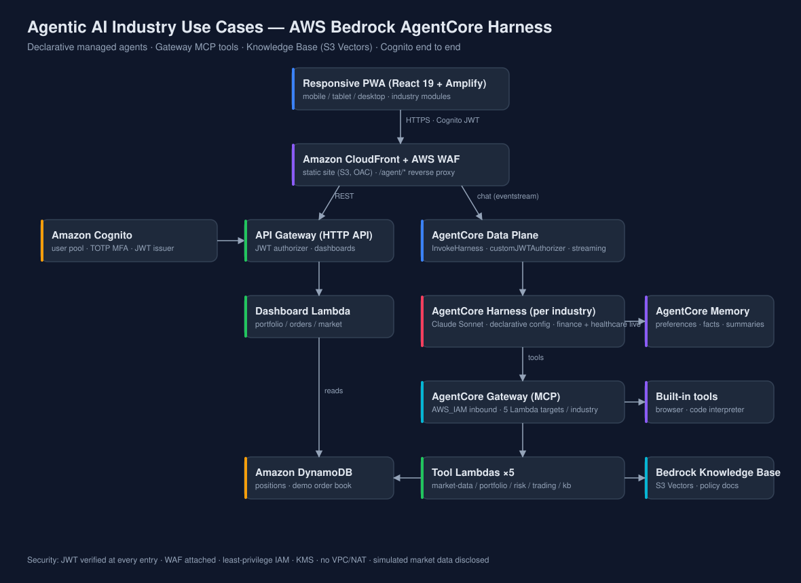

# Agentic AI Industry Use Cases — on AWS Bedrock AgentCore Harness

[繁體中文](README.zh-TW.md)

Industry agentic-AI applications rebuilt on **AWS Bedrock AgentCore Harness** — declarative,
fully-managed agents (no containers, no agent loop to write) with **Gateway MCP tools**,
a **Bedrock Knowledge Base (S3 Vectors)**, **managed Memory**, and a single **Cognito-secured
responsive PWA** frontend.

**All six industries are deployed end-to-end and verified** — each has its own harness,
Gateway with 5 MCP tool targets, Knowledge Base on S3 Vectors, managed Memory, and log/trace
delivery, all reachable from the one PWA. All six also have a purpose-built dashboard backed
by its own REST routes (3-5 per industry), verified against the deployed API and screenshotted
at desktop and mobile widths.

## Architecture



### Request flow



**Security posture:** Cognito user pool (TOTP MFA, advanced security, 12-char passwords),
JWT verified at every entry point (harness `customJWTAuthorizer` + API Gateway authorizer),
WAF attached to CloudFront, least-privilege per-Lambda IAM, KMS on data stores, private
S3 behind CloudFront OAC, no long-lived secrets in code.

## Repository layout

| Path | What it is |
|---|---|
| `harnesses/<industry>/` | Declarative harness config template, memory strategies, system prompt |
| `tools/<industry>/` | Gateway Lambda tool handlers + MCP tool schemas |
| `tools/shared/toolkit/` | Shared dispatch, DynamoDB helpers, deterministic market simulator |
| `kb/<industry>/seed-docs/` | Knowledge-base seed documents (policies, product guides) |
| `skills/` | AgentCore Skills (git-sourced; wired post-merge) |
| `infra/cdk/` | 11 CDK stacks: SharedSecurity, Auth, FinanceData, FinanceTools, Api, Web + one `IndustryStack` per non-finance industry (Healthcare, Insurance, Retail, Manufacturing, Realestate) |
| `deploy/` | Orchestrator + idempotent scripts (gateway, memory, seed, render, smoke) |
| `web/` | Unified responsive PWA (Vite + React 19 + Tailwind + Amplify Auth) |
| `tests/` | Unit (pytest + moto), infra (CDK assertions), E2E (Playwright) |

## Deploy

Prereqs: Python 3.11+, Node 22+, AWS credentials, `boto3 >= 1.43.51`.

```bash
make setup            # venv + deps + CDK CLI
make test             # unit + infra tests
make deploy-finance   # CDK → seed → gateway → harness → memory → observability → smoke
make deploy-web       # build PWA → deploy WebStack → publish to CloudFront

# any other industry, same pipeline:
python deploy/deploy.py --industry healthcare|insurance|retail|manufacturing|realestate
```

`deploy/deploy.py` sequences everything and is idempotent — rerun it safely, or resume with
`--from-step gateway` / `--only smoke`. Each industry's CDK outputs are merged into
`deploy/outputs/cdk-outputs.json` rather than overwriting it, so deploying industry N keeps
industries 1..N-1 usable. The AgentCore Harness Builder skill's scripts (preflight, validate,
create/update harness, invoke) are used underneath; set `HARNESS_SKILL_DIR` if the skill
lives elsewhere.

### Verify

```bash
make test                                   # unit (pytest + moto) + infra + web (node --test)
.venv/bin/python deploy/smoke_suite.py      # gateway tools, KB, memory (JWT end-user path)
make verify-harnesses                       # every LIVE harness can actually reach its tools
cd tests/e2e && BASE_URL=https://<cloudfront> E2E_EMAIL=... E2E_PASSWORD=... npx playwright test
```

`make verify-harnesses` exists because of a failure nothing else caught. The live harnesses had
drifted to an `allowedTools` pattern list that matched nothing, so each agent could see only its
`skills` tool — and instead of refusing, it answered from memory and invented market data
(reporting the S&P 500 at 5,248 when the tool returns 6,120.35). The gateway was `READY`, all
targets `READY`, all 17 tools worked when called directly over MCP, IAM simulated as `allowed`,
and every deploy step exited 0. The only trace was `"Unknown tool: …"` inside a tool-result event
that both the smoke script and the web client discarded. So the check asks a live harness to
*use* a tool and reads the **tool-result events, not the prose** — an agent cut off from its
tools produces confident-looking text, which is why asserting on wording would be worse than no
check at all.

### Observability & online evaluations

Each harness ships OTel spans to X-Ray Transaction Search (the `aws/spans` log group), and an
online evaluator per industry (`<industry>_harness_quality`) scores those spans on a schedule;
results land in `/aws/bedrock-agentcore/evaluations/results/…` and in the AgentCore console
under **Evaluations**.

This pipeline has its own silent failure mode, and we hit it: the harness role was missing
`xray:PutTraceSegments` / `xray:PutTelemetryRecords` / `cloudwatch:PutMetricData`, so the
runtime's OTel exporter got 403 on every span batch. Nothing surfaced the error — harness
responses stayed perfect, log delivery was `ENABLED`, evaluators sat `ACTIVE` — but `aws/spans`
never saw a span, so every evaluator had nothing to score and the result log groups stayed empty
for six months. The `IndustryStack` harness role now carries an `ObservabilityTraces` statement
(resource `*` because `xray:Put*` has no resource-level scoping). To check the pipeline is live,
verify spans arrive, not that components report healthy:

```bash
aws logs filter-log-events --log-group-name aws/spans \
  --filter-pattern '"harness_finance_trading"' --max-items 1   # expect ≥1 event after any chat
```

## The six industries

Every industry runs the same shape: 4 domain tool Lambdas + a KB-search Lambda behind its own
Gateway (5 MCP targets), one harness, one Knowledge Base, one Memory.

| Industry | Agent | Gateway tool targets | UI |
|---|---|---|---|
| Finance Trading | `finance_trading_assistant` | market-data / portfolio / risk / trading / kb | Dashboard + chat |
| Healthcare Medical | `healthcare_medical_assistant` | clinical / analytics / records / scheduling / kb | Patient 360 dashboard + chat |
| Insurance Claims | `insurance_claims_assistant` | claims / fraud-detection / policy / settlement / kb | Claims queue dashboard + chat |
| Retail Inventory | `retail_inventory_assistant` | inventory / demand-forecast / supplier / pricing / kb | Inventory dashboard + chat |
| Manufacturing Maintenance | `manufacturing_maintenance_assistant` | equipment / prediction / maintenance / parts / kb | Asset health dashboard + chat |
| Real Estate Valuation | `real_estate_valuation_assistant` | valuation / market / investment / property / kb | Valuation dashboard + chat |

All six were brought online by the same command — `python deploy/deploy.py --industry <name>` —
with **zero new stack code** per industry: the parameterized `IndustryStack` plus the
gateway/harness/memory/observability scripts read everything from `deploy/industries.py`.
Each dashboard's REST routes are declared in `DASHBOARD_ROUTES` (`infra/cdk/app.py`) and served
by one `dashboard_api` Lambda per industry that imports the *same* tool handlers the agent calls
through the Gateway — so a number on a tile and the number the agent quotes in chat come from one
function, not two implementations.

### Dashboard coherence

The simulated payloads are built so that figures describing one entity cannot contradict each
other. Every derived number is computed from the number displayed above it, and every route
touching the same entity reads from one shared basis (`property_basis`, `asset_basis`,
`retail_basis`, `market_basis` in `tools/shared/toolkit/`). Independent draws produce visible
nonsense — a market tile reading `$528K` above its own history chart topping out at `$780K`, a
tile labelled `Median $/Sq Ft` showing a rate no row in the table beneath it contains, or a
`YoY +8.8%` tile above a chart headed `+8.1% over period` for the same twelve months.
`tests/unit/test_industry_dashboard_apis.py` pins each of these as a regression.

### Starter questions

Each industry's empty AI Assistant pane offers 3–5 starter questions
(`web/src/industries/starterPrompts.ts`) so a first-time visitor has somewhere to click. They
are worded as a practitioner in that seat would ask, read-only first so the opening click never
mutates state, and clicking one sends it immediately (unlike the dashboard's **Ask agent**
buttons, which prefill because they fire mid-conversation).

Every entity id and enum value in a prompt is grounded in the real tool data. This matters more
than it sounds: the shared bases fabricate rather than fail, so `sku_basis("SKU-1001")` returns a
plausible "Product 1001" and the agent confidently answers about an item that exists nowhere else
in the app. `tests/unit/test_starter_prompts.py` parses the TypeScript (rather than duplicating
the list, which would drift) and asserts every SKU, asset, provider, patient, market and ticker
against the shared catalogs, every stated enum against the handler's own accepted set, and calls
all 26 tool paths to confirm each returns populated data.

### Reading the answers

An answer arriving as an unreadable wall of text is fixed at three layers.

**Markdown rendering.** Assistant replies are parsed as GitHub-flavored Markdown
(`web/src/components/Markdown.tsx`). Before this they went through `whitespace-pre-wrap`, so a
model that was already emitting a correct table rendered it as raw `|` pipes. Every element is
styled explicitly rather than via a typography plugin, because the defaults assume a light
background and a full-width article; tables get a horizontal scroller, since six numeric columns
do not fit a phone and silent clipping loses the last column — usually the one being asked about.

**A transient chart panel.** When an answer is built on a tool whose payload is worth plotting,
a chart appears above the industry dashboard (`web/src/components/AnswerChartPanel.tsx`); below
`lg` it renders inline under the message instead. It stacks over the dashboard rather than
replacing it and is dismissible — the dashboard is the standing view and this is a by-product of
one question.

The charts are drawn from the tool payload **the agent itself received**, extracted from the
invoke event stream (`web/src/lib/toolTrace.ts`). It is deliberately not a re-fetch of the
matching dashboard route: a re-fetch can return different numbers than the reply on screen
(different arguments, a later timestamp), and a chart that silently disagrees with the text
beside it is worse than no chart. Forty-six recognizers (`web/src/lib/chartSpec.ts`) — enough
that every starter question in every industry produces a panel (26/26, measured against the
live app by `tests/e2e/starter-charts-audit.spec.ts`) — each re-validate the shape they expect
and return nothing on a mismatch, so an unrecognized tool produces no panel rather than a
guess. Threshold lines obey two more rules: a line recharts would silently drop for sitting
outside the axis extends the axis instead (`ifOverflow="extendDomain"`), and a recognizer
withholds a line so far out that the series itself would be squashed below a third of the plot
— except a sensor chart's nearest limit, where the gap between the reading and the line *is*
the answer.

Correlating those events is the subtle part: a `toolResult` carries neither a tool name nor a
`toolUseId`, so the name is recoverable only via `contentBlockIndex` → `toolUseId` → `name`, and
block indexes are **reused within a single turn** — the failure mode being one tool's payload
filed under another tool's name. Results that failed, that carry a non-JSON body, or whose name
was never seen are all refused; during a gateway outage the agent wrote a confident market
summary with invented index levels, and charting *attempted* calls would have drawn an empty
chart beside fabricated prose.

**UI language.** The interface is user-selectable across sixteen languages (English, Traditional
and Simplified Chinese, Japanese, Korean, French, Spanish, Italian, Portuguese, German,
Indonesian, Malay, Thai, Vietnamese, Filipino, Hindi) via a picker in the header and on the login
page. The i18n layer is hand-rolled (`web/src/i18n/`): one TypeScript catalog per locale typed
`satisfies Messages` against the English schema, so a missing translation key in any language is
a compile error; English ships in the main bundle as the fallback and the other fifteen load as
their own lazy chunks (~10 kB gzip each). Chart titles are translated at render time only — the
spec's English strings remain its identity (dedupe, pagination, E2E hooks), pinned by a
reconstruction test that rebuilds every English string from its catalog key and parameters
(`tests/unit/chartI18n.test.ts`). Payload values (ids, enums, backend prose) deliberately pass
through untranslated.

**Reply language.** The agent answers in the language of the question, and the UI locale fills in
where the text is ambiguous (`web/src/lib/replyLanguage.ts`). Two ranked signals: a decisive
non-Latin script in the typed message wins outright (kana → Japanese, Hangul → Korean, Thai,
Devanagari → Hindi; Han uses the picker as the Traditional-vs-Simplified tiebreaker), while Latin
prose — which script alone cannot pin to one language — follows the picker, so a canned English
starter question asked under a Thai UI is answered in Thai. Technical Chinese full of English
tickers stays Chinese, a stray CJK character in an English sentence stays English, and with the
untouched English default anything genuinely ambiguous still sends no directive at all, since a
wrong explicit instruction is worse than none.

## Data honesty

Finance now runs **two clearly-separated data worlds**, and every payload says which one it
belongs to:

- **`"source": "live"`** — real US market data (tracked-stock quotes, index levels via QQQ/SPY
  ETF proxies — Twelve Data's free tier gates true index symbols, so proxies are used and
  labeled `proxy: true`; the official Nasdaq Composite daily close comes from FRED `NASDAQCOM` —
  the full Treasury yield curve, policy rates, fundamentals) from official providers only:
  **Finnhub**, **Twelve Data** (gold, Phase 2), and **FRED** (St. Louis Fed). A scheduled collector Lambda is
  the sole component that calls providers (EventBridge Scheduler, market hours in
  `America/New_York`); tools and dashboard read the DynamoDB snapshot it writes, so a tile
  number and the agent's quoted number come from the same row. Live payloads carry `provider`,
  `fetched_at`, and `delay`, surfaced in the UI as a green **LIVE** badge; snapshots older than
  2× their cadence are flagged `"stale": true`. History accumulates in S3
  (`market/<dataset>/dt=…/*.jsonl.gz`, Athena-queryable).
  We deliberately **rejected scraping** (e.g. bloomberg.com via the browser tool): it violates
  the site's ToS, breaks on every DOM change, and delivers numbers with no freshness contract.
- **`"source": "simulated"`** — the demo trading system (`tools/shared/toolkit/market_sim.py`):
  deterministic, reproducible, no API keys. Portfolio, orders, risk, and the simulated market
  section stay in this world so fills and P&L remain internally coherent (amber badge). Orders
  are real writes to the demo order book (DynamoDB) and genuinely mutate positions.

The agent's system prompt requires disclosing provider + as-of time for live numbers and
saying explicitly when an answer mixes live market context with simulated portfolio state.
Real-world lookups (news, SEC filings) go through the harness's built-in browser tool.

### Live-market setup (one-time)

The collector needs three free API keys in SSM (the `secrets` deploy step checks and prints
these commands if missing):

```bash
aws ssm put-parameter --name /agentic/finance/finnhub-api-key    --type SecureString --value '<key>'
aws ssm put-parameter --name /agentic/finance/twelvedata-api-key --type SecureString --value '<key>'
aws ssm put-parameter --name /agentic/finance/fred-api-key       --type SecureString --value '<key>'
```

Register: [Finnhub](https://finnhub.io/register) · [Twelve Data](https://twelvedata.com/register)
· [FRED](https://fredaccount.stlouisfed.org/apikeys). Free tiers are ample: the schedules use
<2% of Finnhub's and ~10% of Twelve Data's daily quota; FRED is unlimited.

## Costs

Rough demo-scale monthly costs (us-east-1): CloudFront/S3/Lambda/DynamoDB on-demand ≈ $1–5,
S3 Vectors ≈ pennies, Cognito Plus per-MAU ≈ $0 at demo scale, no NAT/OpenSearch. The main
variable is Bedrock model usage during testing.

## Disclaimer

Demo/reference architecture. Simulated financial data — not investment advice. Review
security, compliance, and cost for your own environment before production use.

## License

Apache-2.0
