# Business Logic Flows — Six Industry Use Cases

[繁體中文](business-flows.zh-TW.md)

How each industry agent actually runs its business process — written for practitioners, not
engineers. Every diagram uses the same grammar: the **spine** (top to bottom) is the business
process; the **left rail** holds the systems and policy documents the process reads; the
**right rail** holds the humans it escalates to. Blue `AI` steps are agent-executed, amber
diamonds are decision gates, rose `COMPLIANCE` boxes are regulatory checkpoints, green
`WRITE` boxes are the only steps that change state — and every one of them sits behind a
confirmation or an approval. Thresholds shown are the ones actually enforced in the agents'
prompts, tools, and knowledge-base policies.

The animated SVGs are generated from declarative specs in
[`business-flows/generate_business_flows.py`](business-flows/generate_business_flows.py)
(with a geometric no-crossing check); the collapsed Mermaid block under each diagram is the
same logic emitted by `--mermaid` — **edit the spec, regenerate both, never hand-edit**.

---

## Finance Trading — Signal to Executed Order

A trading desk lives and dies by knowing *what kind* of number it is looking at. This agent
labels every figure with its data world — **LIVE** (Finnhub/FRED market data), **DERIVED**
(news-scored factor signals, hypothesis-grade), **MODEL** (PRISM regime and tail-risk
output), or **SIMULATED** (demo book) — and never mixes them silently. The PRISM regime read
is deliberately positioned as a historical lens (AUROC 0.85–0.91 against NBER recessions,
but lagging real time by more than 10 trading days): it explains where you have been, and
the agent will refuse to turn it into a crash date.

The path from signal to order runs through two hard gates. Any margin call over $250k
escalates to the Risk Desk the same day, per the margin policy (Reg T 50/30, concentration
surcharges above 40% of account). And no solicited recommendation leaves the suitability
check without matching the client's profile matrix — a Conservative client cannot be shown a
leveraged-ETF idea, full stop; anything out of profile needs a supervisor's documented
sign-off. Only then does the confirm-then-execute rule apply: symbol, side, quantity, and
order type are read back to the client before `place_order` touches the book.


<details>
<summary>Flow logic (Mermaid — editable source)</summary>

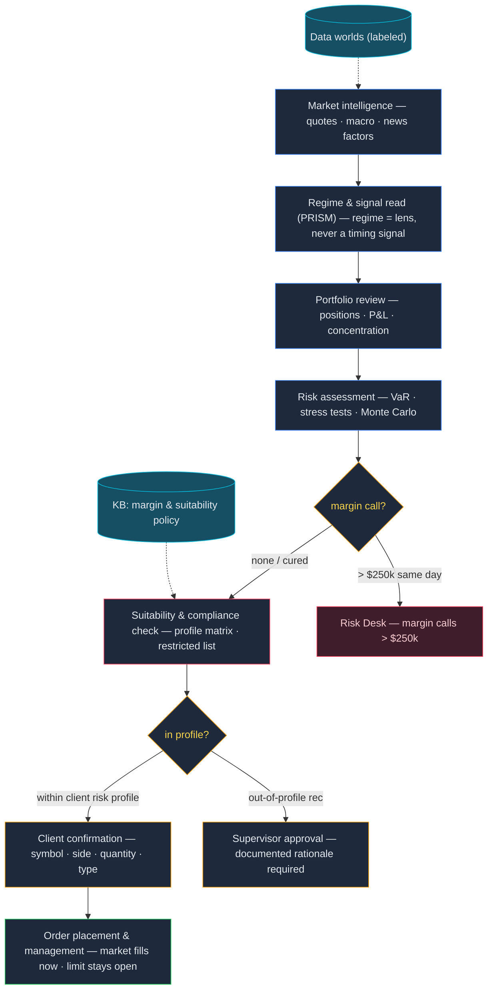

</details>

### Decision gates & guardrails

| Gate | Threshold / trigger | Source policy | Human in the loop |
|---|---|---|---|
| Margin call escalation | call > $250k | `kb/finance/seed-docs/margin-policy.md` | Risk Desk, same day |
| Suitability | recommendation outside profile matrix | `kb/finance/seed-docs/suitability-and-restricted-list.md` | supervisor approval, documented rationale |
| Restricted list | MNPI names · first 10 days post-IPO · SEC suspensions | same | trade blocked |
| Order execution | every order | agent prompt (confirm-then-execute) | client confirms symbol/side/qty/type |

**KPIs:** calibrated 99% VaR (~1.0% violations, Basel green) · regime AUROC 0.85–0.91 ·
zero unsuitable solicited recommendations

---

## Healthcare — Chart Review to Care Plan

Everything in this flow is decision *support*: the agent assembles the chart, scores the
risks, and drafts the plan, but a licensed clinician reviews before anything touches a
patient. The flow cannot even start without HIPAA discipline — two identifiers to verify the
patient, minimum-necessary access, and every record touch audit-logged (who, when, why; six
years' retention).

Two gates protect the clinical middle of the process. Triage follows the RED/ORANGE ladder —
chest pain, stroke signs, or anaphylaxis hand off to the ED immediately, and patients aged
65+ or 5 and under are auto-escalated one level. Then medication safety: a major interaction
(warfarin + aspirin, sertraline + tramadol, and the rest of the curated table) stops the
line until the prescriber acknowledges it. Downstream, care planning turns a LACE+ readmission
score of 30% or more into a transitional-care visit within 7 days, and the only write
actions in the whole flow are appointment scheduling and reminders — which may state date,
time, and provider, but never a diagnosis.


<details>
<summary>Flow logic (Mermaid — editable source)</summary>

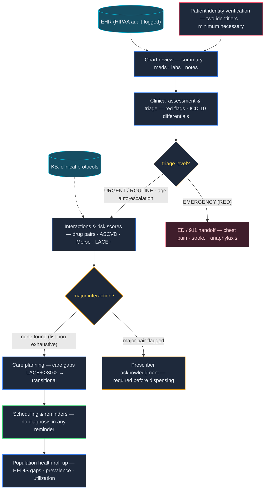

</details>

### Decision gates & guardrails

| Gate | Threshold / trigger | Source policy | Human in the loop |
|---|---|---|---|
| Identity verification | two identifiers before any disclosure | `kb/healthcare/seed-docs/hipaa-phi-handling-policy.md` | disclosure blocked otherwise |
| Triage | EMERGENCY (RED) symptoms · age ≥65 / ≤5 auto-escalates | `kb/healthcare/seed-docs/clinical-protocols.md` | ED / 911 handoff |
| Drug interaction | major-severity pair | `kb/healthcare/seed-docs/medication-safety-protocol.md` | prescriber acknowledgment before dispensing |
| Readmission risk | LACE+ ≥ 30% | clinical protocols | transitional-care visit ≤ 7 days |

**KPIs:** HbA1c < 7.0% (individualized < 8.0%) · BP < 130/80 high-risk · 100% audit-logged
access · critical labs flagged immediately

---

## Insurance Claims — FNOL to Settlement

The manual's first rule is speed with discipline: acknowledge within 24 hours, assign an
adjuster within 48, and set the initial reserve within 5 business days (Chain-Ladder and
Bornhuetter-Ferguson, P10/P50/P90). But nothing moves toward payment until the mandatory
fraud screen has scored the claim: at 0.4 or below it runs the standard track; between 0.4
and 0.7 a senior adjuster runs enhanced review; above 0.7 it goes to SIU **and the
settlement freezes** until the investigation clears — with all claimant communication kept
neutral, because a fraud flag is an investigation trigger, not a determination.

Money then moves only inside the authority ladder: an adjuster signs to $10k, a supervisor
to $25k (and reviews everything above $25k regardless), a director to $100k, and beyond that
a committee. Every determination cites policy language; every denial is written. The
fair-claims clock runs the whole time — respond in 10 business days, decide within 40 days
of proof of loss or send a written delay notice every 30.


<details>
<summary>Flow logic (Mermaid — editable source)</summary>

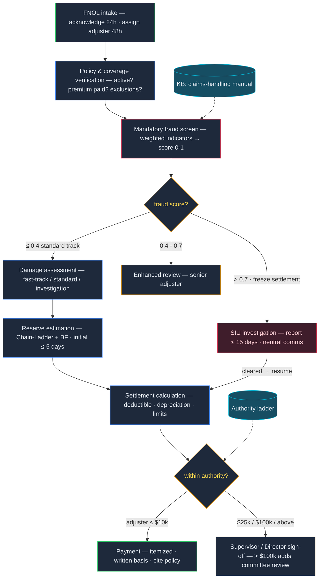

</details>

### Decision gates & guardrails

| Gate | Threshold / trigger | Source policy | Human in the loop |
|---|---|---|---|
| Fraud screen | score 0.4–0.7 / > 0.7 | `kb/insurance/seed-docs/fraud-indicators-guide.md` | enhanced review / SIU + settlement freeze |
| Settlement authority | > $10k / $25k / $100k | `kb/insurance/seed-docs/claims-handling-manual.md` | adjuster / supervisor / director + committee |
| Severe or total loss | before any offer | claims-handling manual | independent adjuster verification |
| Claim submission & approval | every write | agent prompt | user confirms policy no., type, amount, rationale |

**KPIs:** acknowledge ≤ 24h · assign ≤ 48h · initial reserve ≤ 5 days · decide ≤ 40 days ·
SIU report ≤ 15 days

---

## Retail Inventory — Stockout to Reorder to Price

The policy is unambiguous about priorities: A-class items (top 20% of SKUs, ~80% of revenue)
carry a 98% fill-rate target and any A-class stockout gets an expedite review within 4
business hours — and the network is checked first, because an inter-store transfer beats an
emergency purchase order on both speed and cost. Reorders come out of the EOQ model with
safety stock at 7 days (14 for single-source suppliers and the Nov–Jan holiday peak);
overrides for supplier minimums or truckload economics are documented, not silent.

Buying runs through the supplier scorecard (35% on-time, 30% quality, 20% cost, 15%
responsiveness): PREFERRED at 90+, PROBATIONARY below 75 — which means a 90-day improvement
plan and no new SKUs. Purchase orders above $50k need the category manager; above $250k, the
VP. On the sell side the same discipline applies in reverse: no automated price move beyond
±15% in one step, markdowns walk the 25/40/60 ladder at 3-week intervals, and below-cost
pricing needs margin sign-off. Sell-through feeds the next forecast cycle.


<details>
<summary>Flow logic (Mermaid — editable source)</summary>

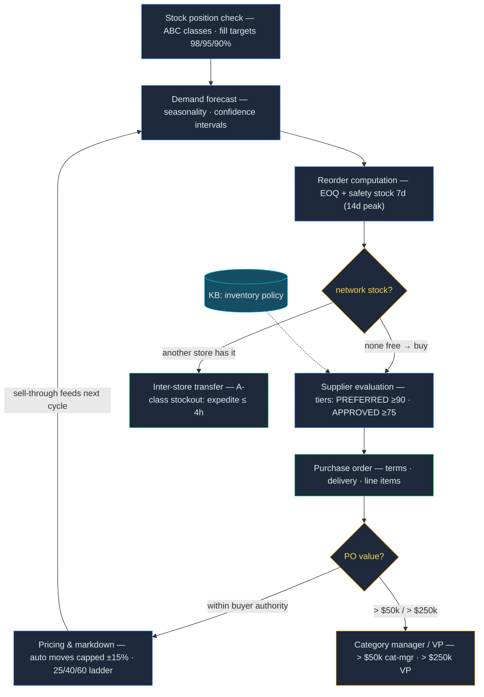

</details>

### Decision gates & guardrails

| Gate | Threshold / trigger | Source policy | Human in the loop |
|---|---|---|---|
| Network stock check | transfer available | `kb/retail/seed-docs/inventory-management-policy.md` | user confirms SKU/qty/locations |
| PO authority | > $50k / > $250k | inventory management policy | category manager / VP |
| Price move | > ±15% in one step, or below cost | inventory management policy | human approval / margin sign-off |
| Single-source risk | no qualified alternate | `kb/retail/seed-docs/supplier-sla-standards.md` | signed risk acceptance |

**KPIs:** fill rates 98/95/90% by class · A-class stockout response ≤ 4h · supplier on-time
≥ 95% · quality ≥ 98.5% · defects ≤ 1,500 PPM

---

## Manufacturing — Sensor to Work Order

Vibration severity is read straight off ISO 10816 Class III: zone C (4.5–11.2 mm/s RMS)
means plan maintenance within two weeks; zone D above 11.2 means the machine stops — on
high-criticality equipment that is an immediate stop, shift-supervisor notification, and a
critical work order in the same shift. Between the sensors and the schedule sits the
diagnostic layer: FFT against the bearing defect frequencies (BPFO/BPFI/BSF/FTF — a defect
tone above 25% of the 1X peak, trending up across two measurements, raises a predictive work
order), anomaly detection, and remaining-useful-life estimation. Predictive triggers override
calendar PMs; the plant target is OEE 75% with reactive work below 30%.

No work order is approved without its permits listed — lockout/tagout for any
energy-isolating work (one lock per authorized worker, only the applier removes it), plus
confined-space and hot-work permits where they apply. Spare parts below $1k auto-issue;
anything at or above needs procurement sign-off. Closing the loop, reliability KPIs
(OEE, MTBF, MTTR) feed back into monitoring thresholds — deferred maintenance is possible,
but only with the reliability manager's documented risk acceptance.


<details>
<summary>Flow logic (Mermaid — editable source)</summary>

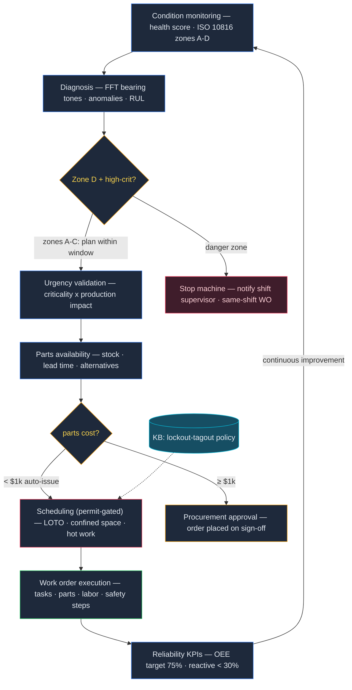

</details>

### Decision gates & guardrails

| Gate | Threshold / trigger | Source policy | Human in the loop |
|---|---|---|---|
| Vibration severity | zone D (> 11.2 mm/s) on high-criticality | `kb/manufacturing/seed-docs/maintenance-standards-summary.md` | stop machine · shift supervisor · same-shift WO |
| Parts cost | ≥ $1,000 | tool policy (`order_spare_parts`) | procurement approval |
| Permit gate | LOTO / confined space / hot work required | `kb/manufacturing/seed-docs/lockout-tagout-safety-policy.md` | work may not start until permits issued |
| Deferred maintenance | any deferral | maintenance standards | reliability manager risk acceptance |

**KPIs:** OEE ≥ 75% (world class 85%) · reactive share < 30% · zone C response ≤ 2 weeks ·
fire watch 60 min after hot work

---

## Real Estate — Subject Property to Value Range

This is the one flow with **zero transactional writes** — it renders opinions, and it is
disciplined about what kind. Comparables follow the appraisal methodology: sales within 6
months preferred (12 with time adjustment at ~0.3%/month), within a mile urban/suburban,
gross living area within ±25%, and the *comparable* is adjusted toward the subject — with
net adjustments over 15% or gross over 25% flagged as weakening the comp. At least two of
the three approaches (sales comparison, income, cost) are reconciled with documented
weighting, and the output is always a **range with a confidence statement, never a bare
point** — stated alongside the USPAP disclosure that an AVM/CMA is not a formal appraisal
and lending or legal use requires a licensed appraiser.

Fair Housing is a hard gate, not a preference: neighborhood demographics are never a value
factor, school quality comes only from published ratings, crime statistics are reported
neutrally, and steering is refused **even when the client requests it** — the agent provides
objective data for all areas matching the client's non-protected criteria instead. If a
completed valuation's impartiality is challenged, a second independent valuation runs and
compliance reviews within 10 business days.


<details>
<summary>Flow logic (Mermaid — editable source)</summary>

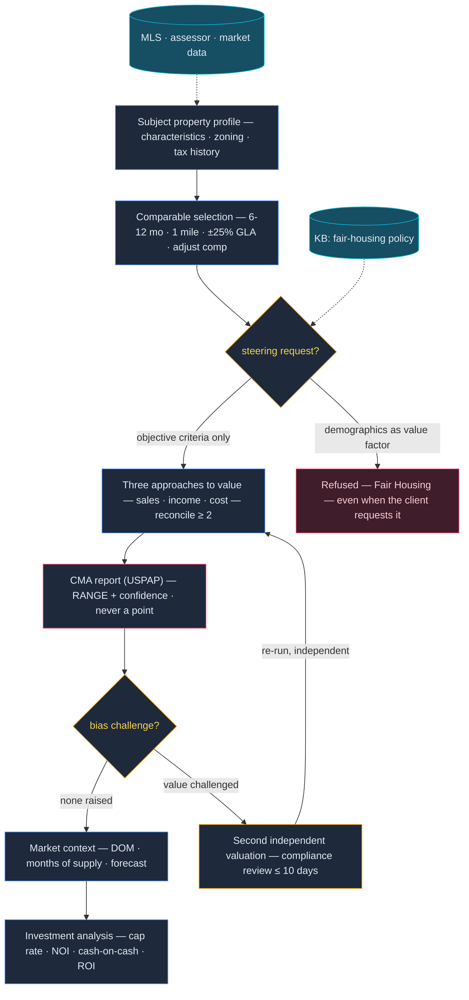

</details>

### Decision gates & guardrails

| Gate | Threshold / trigger | Source policy | Human in the loop |
|---|---|---|---|
| Fair Housing | steering request · demographics as value factor | `kb/realestate/seed-docs/fair-housing-compliance-policy.md` | refused; violations reported ≤ 24h |
| Comp quality | net adj > 15% · gross > 25% | `kb/realestate/seed-docs/appraisal-methodology-guide.md` | flagged in reconciliation |
| Formal valuation | lending / legal use | USPAP (methodology guide) | licensed appraiser required |
| Bias challenge | any challenge to impartiality | fair-housing policy | second independent valuation · review ≤ 10 days |

**KPIs:** value ranges with confidence on 100% of reports · 10% of reports spot-checked
quarterly · workfiles retained 5 years

---

*Regenerate diagrams and mermaid after any spec change:*

```bash
python3 docs/business-flows/generate_business_flows.py            # six SVGs (fails on any edge crossing)
python3 docs/business-flows/generate_business_flows.py --mermaid  # blocks pasted above
```
