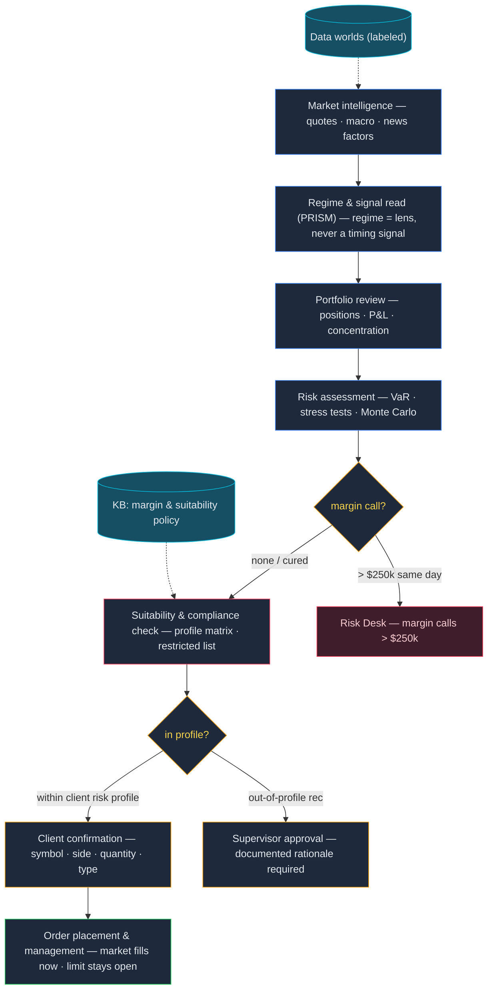
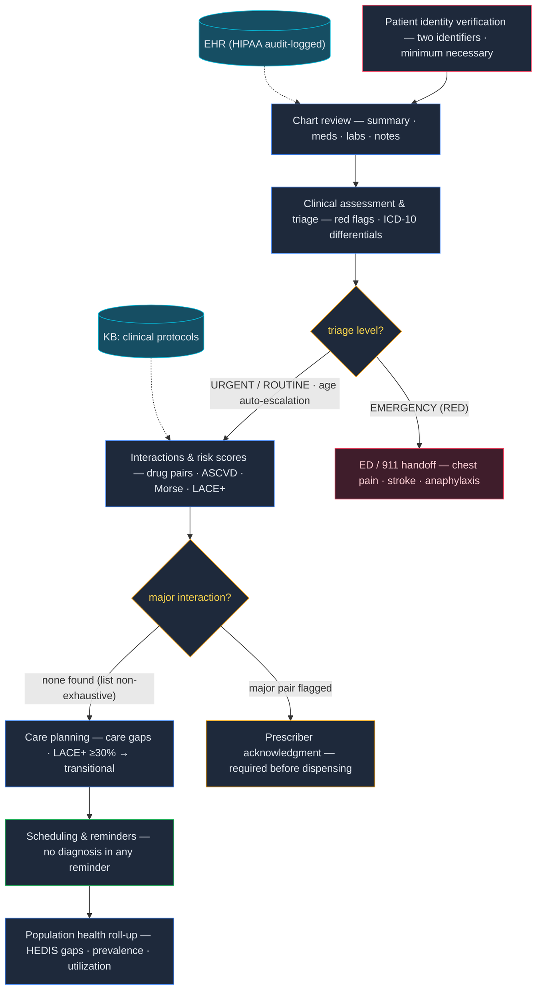
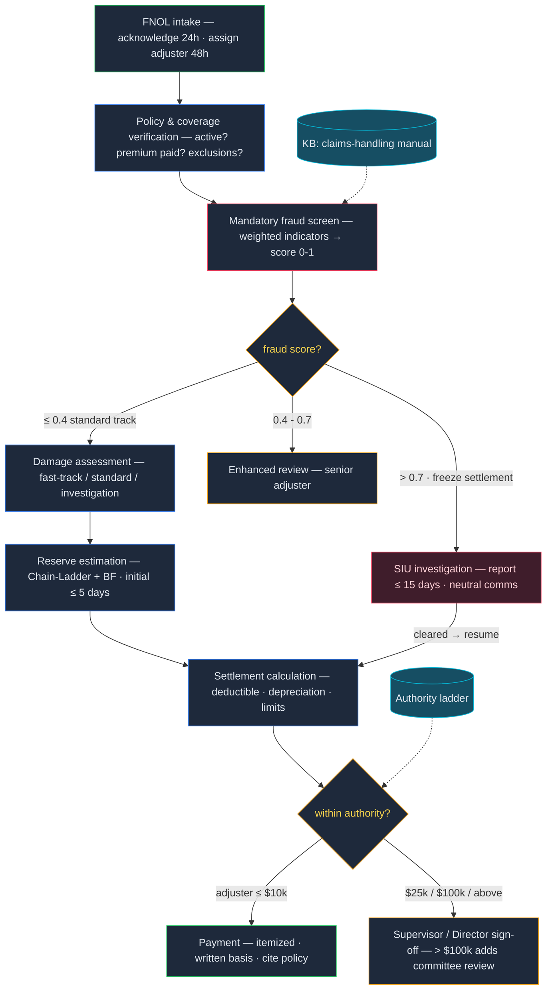
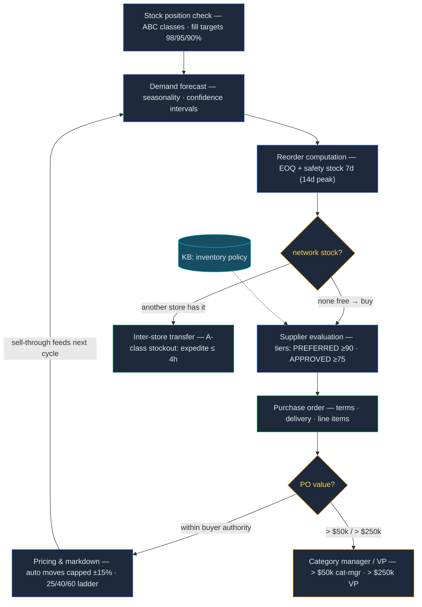
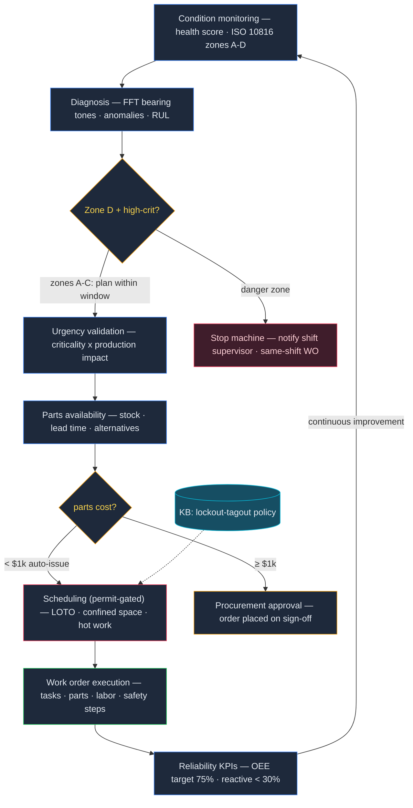
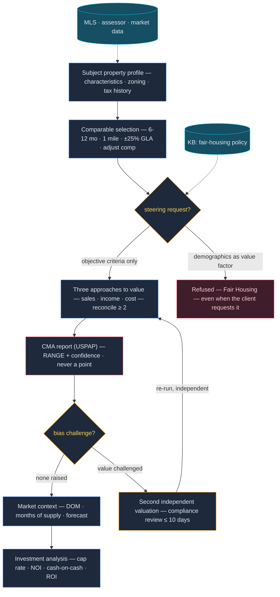

# 業務邏輯流程 — 六大行業用例

[English](business-flows.md)

從資深從業者視角寫給業內人士的流程文檔——不是工程圖。六張圖共用同一套視覺語法：**中軸**
（自上而下）是業務流程本身；**左軌**是流程讀取的系統與政策文件；**右軌**是流程升級（escalate）
到的人。藍色 `AI` 步驟由 agent 執行，琥珀色菱形是決策關卡，玫紅 `COMPLIANCE` 框是合規檢查點，
綠色 `WRITE` 框是全流程中唯一改變狀態的步驟——且每一個都設有確認或審批。圖中所有閾值
都是 agent 提示詞、工具與知識庫政策中實際執行的數字。

動畫 SVG 由
[`business-flows/generate_business_flows.py`](business-flows/generate_business_flows.py)
中的聲明式規格生成（附幾何零相交檢查）；每張圖下方折疊的 Mermaid 塊是同一邏輯經
`--mermaid` 輸出的可編輯源——**改規格、重新生成兩者，永不手改**。圖內標籤保留英文
（與 repo 現有架構圖一致）；下文敘事在每個階段首次出現時給出中文名稱對照。

---

## 金融交易 — 從信號到成交（Finance Trading）

交易台的生死線在於清楚自己看的是*哪一種*數字。這個 agent 給每個數字貼上數據世界標籤——
**LIVE**（Finnhub/FRED 實時行情）、**DERIVED**（新聞因子信號，假說級）、**MODEL**（PRISM
體制與尾部風險輸出）、**SIMULATED**（演示簿記）——絕不無聲混用。PRISM 體制讀數（Regime &
signal read）被刻意定位為歷史透鏡（對照 NBER 衰退 AUROC 0.84–0.86，但實時滯後超過 10 個
交易日）：它解釋你走過的路，agent 會拒絕把它變成崩盤日期。

從信號到下單要過兩道硬關卡。任何超過 $250k 的追繳保證金（margin call）當日升級風控台
（Risk Desk）——依保證金政策（Reg T 50/30，帳戶集中度超 40% 加收維持保證金）。任何主動
推薦（solicited recommendation）都必須先過適當性檢查（Suitability & compliance check）
匹配客戶風險畫像——保守型客戶不可能被展示槓桿 ETF，沒有例外；超出畫像的推薦需要主管
書面簽核。之後才輪到「先確認後執行」：向客戶回讀代碼、方向、數量、訂單類型，
`place_order` 才碰帳簿。


<details>
<summary>流程邏輯（Mermaid — 可編輯源）</summary>



</details>

### 決策關卡與護欄

| 關卡 | 閾值 / 觸發 | 政策出處 | 人工環節 |
|---|---|---|---|
| 追繳保證金升級 | 追繳 > $250k | `kb/finance/seed-docs/margin-policy.md` | 風控台，當日 |
| 適當性 | 推薦超出風險畫像矩陣 | `kb/finance/seed-docs/suitability-and-restricted-list.md` | 主管審批 + 書面理由 |
| 限制名單 | MNPI 標的 · IPO 後 10 個交易日 · SEC 停牌 | 同上 | 交易攔截 |
| 訂單執行 | 每一筆訂單 | agent 提示詞（先確認後執行） | 客戶確認代碼/方向/數量/類型 |

**KPI：** 校準 99% VaR（違例率 ~1.0%，Basel 綠區）· 體制 AUROC 0.84–0.86 · 不適當主動推薦零容忍

---

## 醫療 — 從病歷審閱到照護計劃（Healthcare）

這條流程裡的一切都是決策*支持*：agent 彙整病歷、算風險分、起草計劃，但任何觸及患者的
決定之前都有執業醫師審閱。流程的起點就是 HIPAA 紀律——兩個標識符核驗患者身份（Patient
identity verification）、最小必要訪問、每次調閱都留審計日誌（誰、何時、為何；留存六年）。

臨床中段有兩道關卡。分診（triage）走 RED/ORANGE 階梯——胸痛、卒中徵象、過敏性休克立即
轉急診（ED / 911 handoff），且 65 歲以上或 5 歲以下患者自動升一級。然後是用藥安全：
主要級別藥物相互作用（major interaction——華法林+阿司匹林、舍曲林+曲馬多等清單）會停線，
直到處方醫師確認（Prescriber acknowledgment）。下游的照護計劃（Care planning）把 LACE+
再入院風險 ≥30% 轉化為 7 天內的過渡照護就診；全流程僅有的寫入操作是排程與提醒
（Scheduling & reminders）——提醒可含日期、時間、醫師，但絕不含診斷。


<details>
<summary>流程邏輯（Mermaid — 可編輯源）</summary>



</details>

### 決策關卡與護欄

| 關卡 | 閾值 / 觸發 | 政策出處 | 人工環節 |
|---|---|---|---|
| 身份核驗 | 任何披露前需兩個標識符 | `kb/healthcare/seed-docs/hipaa-phi-handling-policy.md` | 否則攔截披露 |
| 分診 | EMERGENCY (RED) 症狀 · 年齡 ≥65 / ≤5 自動升級 | `kb/healthcare/seed-docs/clinical-protocols.md` | 急診 / 911 交接 |
| 藥物相互作用 | 主要級別配對 | `kb/healthcare/seed-docs/medication-safety-protocol.md` | 處方醫師確認後方可配藥 |
| 再入院風險 | LACE+ ≥ 30% | 臨床協議 | ≤ 7 天過渡照護就診 |

**KPI：** HbA1c < 7.0%（個體化 < 8.0%）· 高危血壓 < 130/80 · 訪問 100% 留審計 · 危急值即時上報

---

## 保險理賠 — 從報案到理算（Insurance Claims）

理賠手冊的第一條是有紀律的速度：24 小時內確認報案（FNOL intake）、48 小時內指派理賠員、
5 個工作日內設定初始準備金（Reserve estimation——Chain-Ladder 加 Bornhuetter-Ferguson，
P10/P50/P90）。但在強制欺詐篩查（Mandatory fraud screen）給出分數之前，一分錢都不會動：
≤0.4 走標準通道；0.4–0.7 由資深理賠員加強審查（Enhanced review）；>0.7 移交特別調查組
（SIU）**且理算凍結**直到調查放行——期間對索賠人的溝通保持中性措辭，因為欺詐標記是
調查觸發器，不是結論。

之後資金只在授權階梯（Authority ladder）內移動：理賠員簽到 $10k，主管到 $25k（且 $25k
以上一律主管複核），總監到 $100k，再往上加委員會。每項承保判定都引用保單條文；每次拒賠
都以書面說明。公平理賠時鐘全程在跑——10 個工作日內回應，收到損失證明後 40 天內裁決，
否則每 30 天發書面延遲通知。


<details>
<summary>流程邏輯（Mermaid — 可編輯源）</summary>



</details>

### 決策關卡與護欄

| 關卡 | 閾值 / 觸發 | 政策出處 | 人工環節 |
|---|---|---|---|
| 欺詐篩查 | 分數 0.4–0.7 / > 0.7 | `kb/insurance/seed-docs/fraud-indicators-guide.md` | 加強審查 / SIU + 理算凍結 |
| 理算授權 | > $10k / $25k / $100k | `kb/insurance/seed-docs/claims-handling-manual.md` | 理賠員 / 主管 / 總監 + 委員會 |
| 重大或全損 | 任何報價之前 | 理賠手冊 | 獨立理賠師現場核驗 |
| 立案與批付 | 每次寫入 | agent 提示詞 | 用戶確認保單號、類型、金額、理由 |

**KPI：** 確認 ≤ 24h · 指派 ≤ 48h · 初始準備金 ≤ 5 天 · 裁決 ≤ 40 天 · SIU 報告 ≤ 15 天

---

## 零售庫存 — 從缺貨到補貨到定價（Retail Inventory）

政策對優先級毫不含糊：A 類商品（前 20% SKU，約 80% 營收）背 98% 滿足率目標，A 類缺貨
4 個營業小時內啟動加急審查——而且先查全網庫存（network stock），因為店間調撥
（Inter-store transfer）在速度和成本上都勝過緊急採購單。補貨量出自 EOQ 模型加安全庫存
7 天（單一貨源與 11 月–1 月旺季為 14 天）；因供應商起訂量或整車經濟性而覆蓋模型時必須
留檔，不得無聲操作。

採購走供應商記分卡（Supplier evaluation——35% 準時 + 30% 質量 + 20% 成本 + 15% 響應）：
90 分以上 PREFERRED，75 分以下 PROBATIONARY——意味著 90 天改進計劃且不上新 SKU。採購單
超 $50k 要品類經理，超 $250k 要 VP。賣場端同樣的紀律反向適用：自動調價單步不得超過
±15%，清倉沿 25/40/60 折扣階梯每 3 週走一級，低於成本定價需毛利簽核。售罄數據回饋
下一輪需求預測（Demand forecast）。


<details>
<summary>流程邏輯（Mermaid — 可編輯源）</summary>



</details>

### 決策關卡與護欄

| 關卡 | 閾值 / 觸發 | 政策出處 | 人工環節 |
|---|---|---|---|
| 全網庫存檢查 | 可調撥 | `kb/retail/seed-docs/inventory-management-policy.md` | 用戶確認 SKU/數量/門店 |
| 採購授權 | > $50k / > $250k | 庫存管理政策 | 品類經理 / VP |
| 調價 | 單步 > ±15% 或低於成本 | 庫存管理政策 | 人工批准 / 毛利簽核 |
| 單一貨源風險 | 無合格備選 | `kb/retail/seed-docs/supplier-sla-standards.md` | 簽署風險接受書 |

**KPI：** 分類滿足率 98/95/90% · A 類缺貨響應 ≤ 4h · 供應商準時 ≥ 95% · 質量 ≥ 98.5% · 缺陷 ≤ 1,500 PPM

---

## 製造 — 從傳感器到工單（Manufacturing）

振動嚴重度直接按 ISO 10816 Class III 讀：C 區（4.5–11.2 mm/s RMS）意味著兩週內安排維護；
D 區超過 11.2 就停機——高關鍵度設備立即停機（Stop machine）、通知當班主管、同一班次開
緊急工單。傳感器與排程之間是診斷層（Diagnosis）：對軸承缺陷頻率做 FFT（BPFO/BPFI/BSF/FTF
——缺陷音超過 1X 峰值 25% 且連續兩次測量走高，即開預測性工單）、異常檢測、剩餘壽命
（RUL）估計。預測性觸發覆蓋日曆保養；工廠目標 OEE 75%，反應性維修佔比低於 30%。

沒有列明許可證的工單不予批准——任何涉及能量隔離的作業必須上鎖掛牌（LOTO：一人一鎖、
誰上誰摘），受限空間與動火作業另加許可。備件低於 $1k 自動發料；達到 $1k 需採購簽核
（Procurement approval）。閉環端，可靠性 KPI（OEE、MTBF、MTTR）回饋監測閾值——維護可以
延期，但只能由可靠性經理書面接受風險。


<details>
<summary>流程邏輯（Mermaid — 可編輯源）</summary>



</details>

### 決策關卡與護欄

| 關卡 | 閾值 / 觸發 | 政策出處 | 人工環節 |
|---|---|---|---|
| 振動嚴重度 | 高關鍵度設備 D 區（> 11.2 mm/s） | `kb/manufacturing/seed-docs/maintenance-standards-summary.md` | 停機 · 當班主管 · 同班次工單 |
| 備件成本 | ≥ $1,000 | 工具政策（`order_spare_parts`） | 採購簽核 |
| 許可證關卡 | 需 LOTO / 受限空間 / 動火 | `kb/manufacturing/seed-docs/lockout-tagout-safety-policy.md` | 許可證未發，作業不得開始 |
| 延期維護 | 任何延期 | 維護標準 | 可靠性經理書面接受風險 |

**KPI：** OEE ≥ 75%（世界級 85%）· 反應性佔比 < 30% · C 區響應 ≤ 2 週 · 動火後火警值守 60 分鐘

---

## 房地產 — 從標的物業到價值區間（Real Estate）

這是六條流程中唯一**零寫入操作**的一條——它輸出意見，而且對輸出哪種意見極有紀律。
可比案例（Comparable selection)遵循評估方法論：優先近 6 個月成交（12 個月為上限，按約
0.3%/月做時間調整）、城區一英里內、建築面積 ±25% 以內，且調整的是*可比案例*向標的靠攏
——淨調整超 15% 或總調整超 25% 都要在對賬中標記為弱化該可比。三種估值路徑（Three
approaches——市場比較、收益、成本）至少對賬兩種並記錄權重，輸出永遠是**帶信心說明的
區間，絕不是裸點估計**（CMA report）——並附 USPAP 聲明：AVM/CMA 不是正式評估，信貸或
法律用途需要持牌評估師。

公平住房（Fair Housing）是硬關卡而非偏好：社區人口構成永遠不作價值因子、學區質量只引
公開評級、犯罪統計中性呈現，引導性選址（steering）**即使客戶主動要求也一律拒絕**——
agent 改為提供客戶非受保護標準下所有匹配區域的客觀數據。若已完成估值的公正性受到質疑
（bias challenge），第二次獨立估值（Second independent valuation）啟動，合規部門 10 個
工作日內複核。


<details>
<summary>流程邏輯（Mermaid — 可編輯源）</summary>



</details>

### 決策關卡與護欄

| 關卡 | 閾值 / 觸發 | 政策出處 | 人工環節 |
|---|---|---|---|
| 公平住房 | 引導性請求 · 人口構成作價值因子 | `kb/realestate/seed-docs/fair-housing-compliance-policy.md` | 拒絕；違規 ≤ 24h 上報 |
| 可比質量 | 淨調整 > 15% · 總調整 > 25% | `kb/realestate/seed-docs/appraisal-methodology-guide.md` | 對賬中標記 |
| 正式估值 | 信貸 / 法律用途 | USPAP（方法論指南） | 需持牌評估師 |
| 公正性質疑 | 任何質疑 | 公平住房政策 | 第二次獨立估值 · ≤ 10 天複核 |

**KPI：** 100% 報告輸出帶信心區間 · 每季抽檢 10% 報告 · 工作底稿留存 5 年

---

*任何規格變更後重新生成圖與 mermaid：*

```bash
python3 docs/business-flows/generate_business_flows.py            # 六張 SVG（任何連線相交即失敗）
python3 docs/business-flows/generate_business_flows.py --mermaid  # 上文粘貼的塊
```
