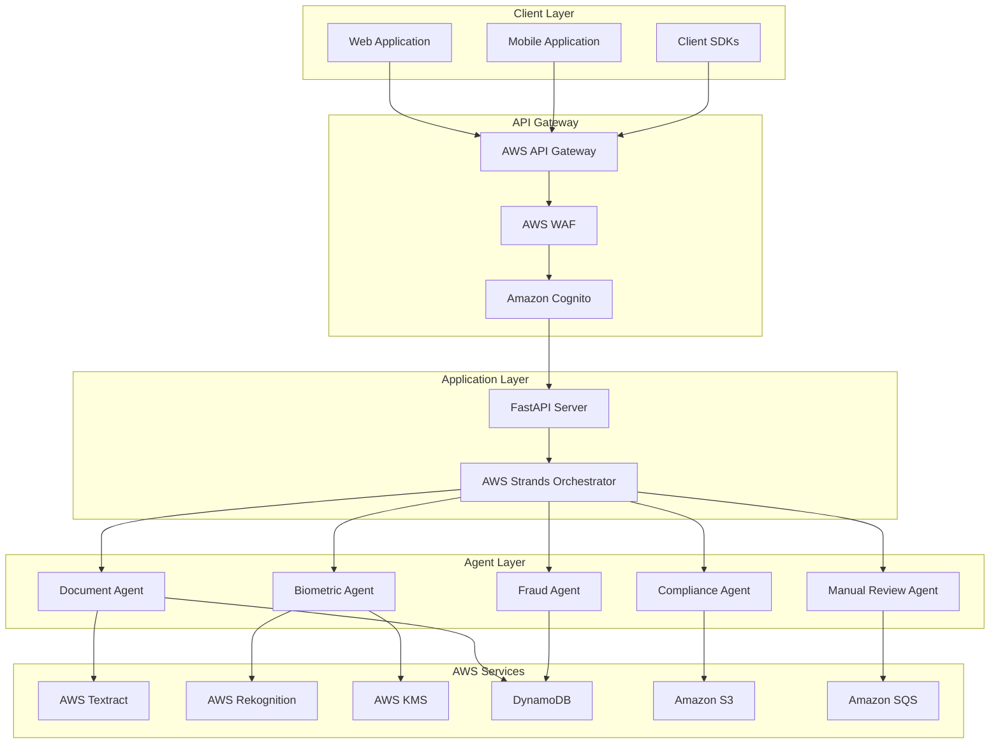
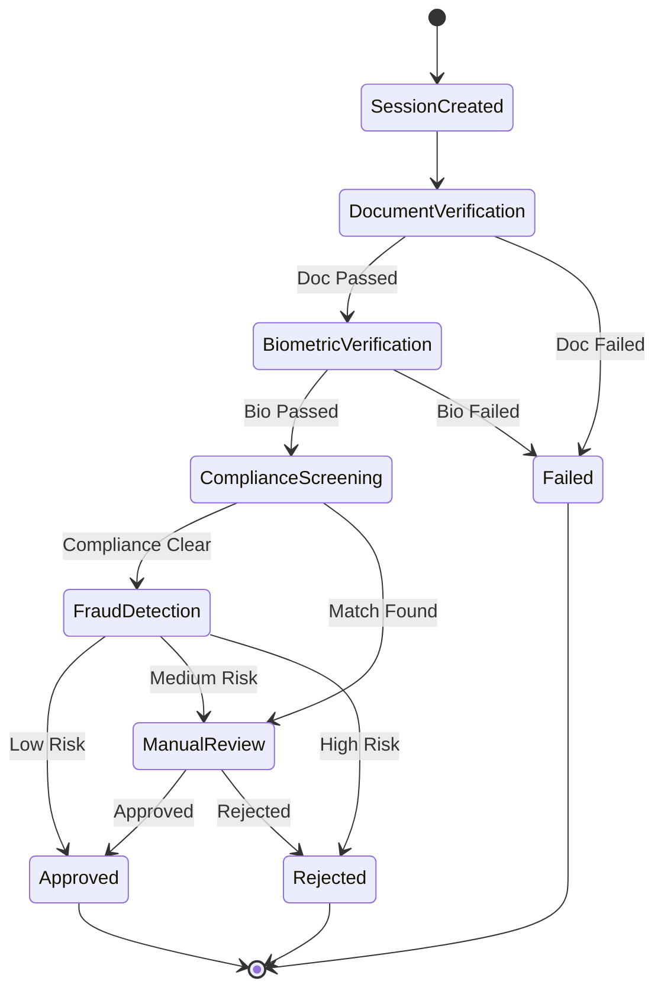
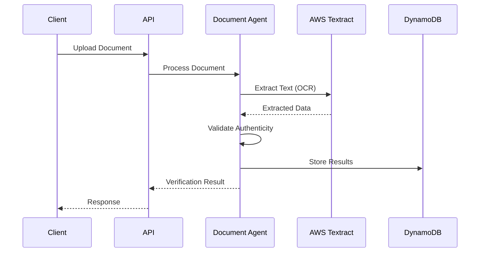
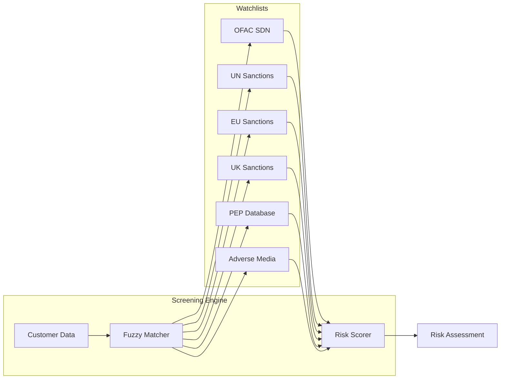
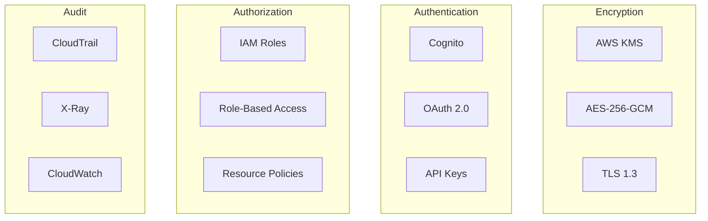
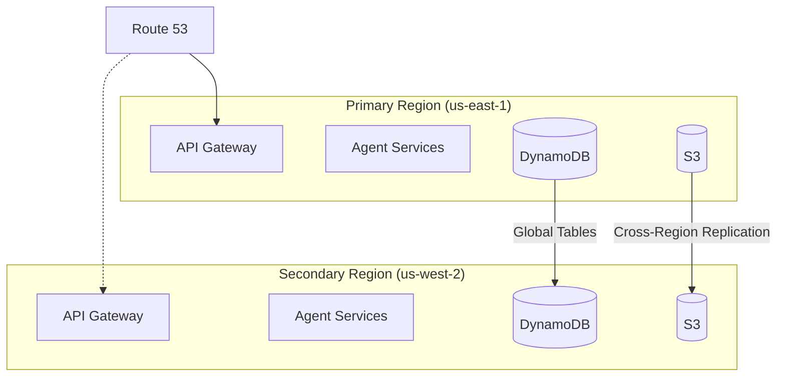

# System Architecture

This document provides a comprehensive overview of the Next-Generation eKYC System architecture.

## Overview

The eKYC System is built on a multi-agent architecture using AWS services for scalability, security, and compliance. The system orchestrates five specialized agents through AWS Strands to provide comprehensive identity verification.

## High-Level Architecture

## Component Details

### 1. API Gateway Layer

The API Gateway layer provides secure, scalable entry points for client applications.

**Components:**
- **AWS API Gateway**: RESTful API endpoints with OpenAPI 3.0 specification
- **AWS WAF**: Web Application Firewall for protection against common attacks
- **Amazon Cognito**: User authentication and OAuth 2.0 token management

**Features:**
- Rate limiting (1,000 requests/minute per organization)
- Request validation and transformation
- SSL/TLS termination
- API versioning support

### 2. Orchestration Layer

The orchestration layer coordinates the verification workflow using AWS Strands.

**AWS Strands Orchestrator:**

**State Machine Features:**
- Workflow state persistence in DynamoDB
- 60-second timeout with graceful degradation
- Automatic retry with exponential backoff
- Event-driven inter-agent communication

### 3. Agent Layer

Five specialized agents handle different aspects of identity verification.

#### Document Verification Agent

**Responsibilities:**
- Document image quality assessment
- OCR extraction using AWS Textract
- Document authenticity verification
- Country-specific validation rules

**Data Flow:**

#### Biometric Verification Agent

**Responsibilities:**
- Face matching between document and selfie
- Active liveness detection (challenge-response)
- Passive liveness detection (texture analysis)
- Biometric data encryption

**Security Measures:**
- AES-256-GCM encryption for biometric templates
- Secure enclave processing where available
- Automatic data purging after verification

#### Compliance Screening Agent

**Responsibilities:**
- Global sanctions list screening (OFAC, UN, EU, UK)
- PEP (Politically Exposed Persons) checking
- Adverse media monitoring
- Risk scoring and match analysis

**Watchlist Integration:**

#### Fraud Detection Agent

**Responsibilities:**
- Device fingerprinting and analysis
- Geolocation and VPN/proxy detection
- Velocity checks and pattern analysis
- ML-based synthetic identity detection

**Risk Scoring:**
| Score Range | Risk Level | Action |
|-------------|------------|--------|
| 80-100 | Very Low | Auto-approve |
| 60-79 | Low | Auto-approve with monitoring |
| 30-59 | Medium | Manual review required |
| 0-29 | High | Auto-reject |

#### Manual Review Agent

**Responsibilities:**
- Review queue management
- Reviewer workload balancing
- SLA tracking and escalation
- Decision recording and audit

### 4. Data Layer

The data layer provides secure, scalable data storage and retrieval.

**DynamoDB Tables:**

| Table | Purpose | Key Schema |
|-------|---------|------------|
| Sessions | Verification sessions | PK: session_id |
| Documents | Document data | PK: session_id, SK: doc_id |
| Biometrics | Encrypted biometric data | PK: session_id |
| Screenings | Compliance results | PK: session_id |
| AuditLogs | Audit trail | PK: entity_id, SK: timestamp |

**S3 Buckets:**

| Bucket | Purpose | Retention |
|--------|---------|-----------|
| ekyc-documents | Document images | 90 days |
| ekyc-biometrics | Encrypted biometrics | 30 days |
| ekyc-audit-logs | Audit archives | 7 years |

### 5. Security Architecture

**Security Controls:**
- Data encrypted at rest with AES-256-GCM
- Data encrypted in transit with TLS 1.3
- Key management through AWS KMS with auto-rotation
- Comprehensive audit logging with 7-year retention
- Role-based access control (RBAC)
- Network isolation with VPC endpoints

## Scalability

### Horizontal Scaling

The system is designed to scale horizontally across all layers:

- **API Layer**: Auto-scaling groups behind load balancer
- **Agent Layer**: Lambda functions or containerized services
- **Data Layer**: DynamoDB on-demand capacity

### Performance Targets

| Metric | Target | Implementation |
|--------|--------|----------------|
| Concurrent Sessions | 10,000+ | Stateless API design |
| Document OCR | <3s | Textract async operations |
| Face Matching | <5s | Rekognition optimized calls |
| Total Workflow | <60s | Parallel agent execution |
| API Response | <100ms | Edge caching, connection pooling |

## Disaster Recovery

### Multi-Region Architecture

### Recovery Objectives

| Metric | Target |
|--------|--------|
| RPO (Recovery Point Objective) | 1 minute |
| RTO (Recovery Time Objective) | 5 minutes |
| Availability SLA | 99.9% |

## Monitoring and Observability

### Metrics Dashboard

Key metrics monitored:
- Verification success/failure rates
- Agent processing times
- Queue depths and SLA compliance
- Error rates and types
- Resource utilization

### Alerting

Critical alerts configured for:
- Verification failure rate > 5%
- P95 latency > 45 seconds
- Error rate > 1%
- Manual review queue > 100 items
- Watchlist match rate anomalies
